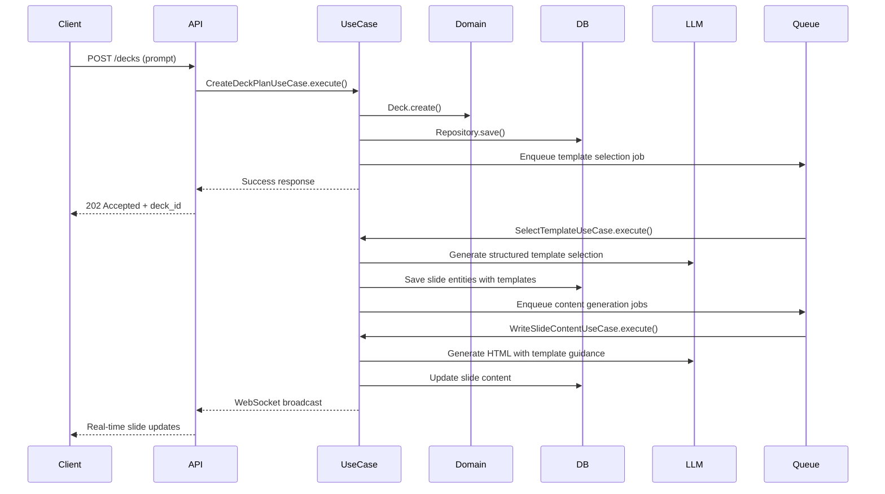

# 🎯 Presto Deck - AI-Powered Presentation Generator

**Use Case-Driven Architecture | Asset Catalog Template System | Real-time Streaming**

Presto Deck은 사용자의 프롬프트를 기반으로 AI를 활용하여 고품질의 프레젠테이션을 실시간으로 생성하는 서비스입니다. Use Case 주도 설계와 이벤트 기반 아키텍처를 통해 확장성과 유지보수성을 극대화했습니다.

---

## 🏗️ 아키텍처 개요

### Use Case-Driven Design (헥사고날 아키텍처)

```
┌─────────────────────────────────────────────────────────────────┐
│                        Presentation Layer                       │
│  ┌─────────────────┐    ┌──────────────┐    ┌─────────────────┐ │
│  │   FastAPI       │    │  WebSocket   │    │   HTTP API      │ │
│  │   Routes        │    │  Handlers    │    │   Endpoints     │ │
│  └─────────────────┘    └──────────────┘    └─────────────────┘ │
└─────────────────────────┬───────────────────────────────────────┘
                          │
┌─────────────────────────▼───────────────────────────────────────┐
│                      Application Layer                          │
│  ┌─────────────────┐  ┌─────────────────┐  ┌─────────────────┐  │
│  │ CreateDeckPlan  │  │ SelectTemplate  │  │WriteSlideContent│  │
│  │   Use Case      │  │   Use Case      │  │   Use Case      │  │
│  └─────────────────┘  └─────────────────┘  └─────────────────┘  │
└─────────────────────────┬───────────────────────────────────────┘
                          │
┌─────────────────────────▼───────────────────────────────────────┐
│                        Domain Core                              │
│  ┌─────────────────┐  ┌─────────────────┐  ┌─────────────────┐  │
│  │      Deck       │  │      Slide      │  │   Validators    │  │
│  │    Entity       │  │    Entity       │  │ & Rules         │  │
│  └─────────────────┘  └─────────────────┘  └─────────────────┘  │
└─────────────────────────┬───────────────────────────────────────┘
                          │
┌─────────────────────────▼───────────────────────────────────────┐
│                    Infrastructure Layer                         │
│  ┌─────────────────┐  ┌─────────────────┐  ┌─────────────────┐  │
│  │   PostgreSQL    │  │    LangChain    │  │   Redis/ARQ     │  │
│  │  Repositories   │  │  LLM Client     │  │   Messaging     │  │
│  └─────────────────┘  └─────────────────┘  └─────────────────┘  │
└─────────────────────────────────────────────────────────────────┘
```

### 핵심 설계 원칙

- **단일 책임**: 각 Use Case는 하나의 비즈니스 플로우만 담당
- **의존성 역전**: 도메인 로직이 인프라에 의존하지 않음
- **Unit of Work**: 트랜잭션 경계를 명확히 정의
- **CQRS-lite**: 읽기/쓰기 책임 분리

---

## ⚙️ 기술 스택

### Backend Core
- **Python 3.13+** with **uv** dependency management
- **FastAPI** with **Pydantic V2** for API layer
- **SQLAlchemy 2.0** with **Alembic** for database management
- **PostgreSQL 15+** as single source of truth
- **Redis** for messaging, caching, and real-time communication

### AI & LLM Integration
- **LangChain** with **structured output** capabilities
- **OpenAI GPT-4** for content generation
- **Pydantic models** for LLM response validation

### Background Processing
- **ARQ** for async task queues
- **Redis Streams** for event sourcing
- **WebSocket** for real-time client updates

### Testing & Quality
- **pytest** with **pytest-asyncio** for comprehensive testing
- **Black** + **Ruff** for code formatting and linting
- **Pre-commit hooks** for code quality enforcement

---

## 🗂️ 프로젝트 구조

```
backend/
├── app/
│   ├── api/                    # FastAPI routes & HTTP schemas
│   │   ├── v1/
│   │   │   ├── decks.py       # Deck management endpoints
│   │   │   └── websocket.py   # Real-time WebSocket handlers
│   │   └── schemas/           # Request/Response DTOs
│   │
│   ├── application/           # Business logic & use cases
│   │   ├── use_cases/
│   │   │   ├── create_deck_plan.py      # 📝 Deck planning use case
│   │   │   ├── select_template.py       # 🎨 Template selection use case
│   │   │   └── write_slide_content.py   # ✍️ Slide content generation
│   │   └── unit_of_work.py              # Transaction boundary management
│   │
│   ├── domain_core/          # Core business entities & rules
│   │   ├── entities/
│   │   │   ├── deck.py       # Deck domain entity
│   │   │   └── slide.py      # Slide domain entity
│   │   ├── value_objects/
│   │   │   ├── deck_status.py          # Deck state enumeration
│   │   │   └── template_selection.py   # Template selection models
│   │   └── validators/       # Domain validation rules
│   │
│   ├── data/                 # Data access layer (CQRS-lite)
│   │   ├── repositories/     # Write-side repositories
│   │   └── queries/          # Read-side query handlers
│   │
│   ├── infra/               # External integrations
│   │   ├── db/              # PostgreSQL connection & models
│   │   ├── llm/             # LangChain LLM integration
│   │   ├── messaging/       # Redis, ARQ, WebSocket
│   │   └── assets/          # 🆕 Template catalog system
│   │
│   └── core/                # Configuration & dependency injection
│       ├── config.py
│       └── dependencies.py
│
├── tests/
│   ├── unit/                # Isolated unit tests with mocks
│   ├── integration/         # Database & external service tests
│   └── e2e/                 # End-to-end workflow tests
│
├── alembic/                 # Database migrations
├── docs/                    # Architecture & API documentation
└── main.py                  # Application entry point
```

---

## 🎯 핵심 Use Cases

### 1. **CreateDeckPlanUseCase** 📝
사용자 프롬프트를 기반으로 프레젠테이션 전체 계획을 생성합니다.

**플로우:**
1. 사용자 입력 검증 및 도메인 규칙 적용
2. Deck 엔티티 생성 (상태: PENDING)
3. LLM을 통한 슬라이드 구조 계획 생성
4. 데이터베이스 트랜잭션 커밋
5. ARQ를 통한 템플릿 선택 작업 큐잉
6. WebSocket 실시간 이벤트 브로드캐스트

### 2. **SelectTemplateUseCase** 🎨
Asset catalog 기반으로 각 슬라이드에 최적화된 템플릿을 선택합니다.

**핵심 특징:**
- **LangChain Structured Output** 활용으로 타입 안전성 확보
- **Asset Catalog 시스템**을 통한 실제 템플릿 파일 연동
- 슬라이드당 **최대 3개 템플릿** 선택 (1개 주 + 2개 대체)
- **Pydantic 모델 기반** 응답 검증

### 3. **WriteSlideContentUseCase** ✍️
선택된 템플릿을 기반으로 실제 슬라이드 HTML 콘텐츠를 생성합니다.

**개선사항:**
- 실제 템플릿 파일을 LLM에게 제공하여 정확한 스타일 적용
- 템플릿별 적응 가이드라인 제공
- Fallback 로직으로 템플릿 누락 상황 대응
- HTML 보안 검증 (`bleach` sanitization)

---

## 🔄 데이터 플로우



---

## 🆕 Template Selection System

### Asset Catalog Architecture

```python
# Template metadata structure (catalog.json)
{
    "intro_slide.html": "Modern introduction slide with hero image support",
    "content_slide.html": "Clean content layout with bullet points",
    "comparison_slide.html": "Side-by-side comparison template",
    "conclusion_slide.html": "Strong closing slide with call-to-action"
}
```

### Structured LLM Output

```python
@dataclass
class DeckTemplateSelections:
    deck_theme: str
    slide_assignments: List[SlideTemplateAssignment]
    template_usage_summary: dict[str, int]

@dataclass
class SlideTemplateAssignment:
    slide_order: int
    slide_title: str
    primary_template: str
    alternative_templates: List[str]  # Max 2 fallbacks
    content_adaptation_notes: str     # LLM guidance for content generation
```

### Benefits of New System

- **타입 안전성**: Pydantic 모델로 런타임 검증
- **유연성**: 새 템플릿 추가 시 catalog.json만 수정
- **정확성**: 실제 템플릿 파일 기반 콘텐츠 생성
- **안정성**: Fallback 로직으로 오류 방지

---

## 🧪 Testing Strategy

### Test Coverage: **25/25 passing** ✅

```bash
# Run all tests
uv run pytest

# Run specific test suites
uv run pytest tests/unit/        # Unit tests with mocks
uv run pytest tests/integration/ # Database integration tests
uv run pytest tests/e2e/         # End-to-end scenarios
```

### Test Architecture
- **Unit Tests**: Mock all external dependencies (LLM, DB, Redis)
- **Integration Tests**: Real PostgreSQL + Redis instances
- **Domain Tests**: Pure business logic validation
- **Use Case Tests**: Complete workflow testing with mocked infra

---

## 🚀 Development Workflow

### Prerequisites
- **Python 3.13+**
- **PostgreSQL 15+**
- **Redis 7+**
- **uv** package manager

### Setup

```bash
# Clone and enter project
git clone <repository-url>
cd presto-deck-v1/backend

# Install dependencies
uv sync

# Activate virtual environment
source .venv/bin/activate

# Run database migrations
uv run alembic upgrade head

# Start development server
uv run uvicorn app.main:app --reload

# Start background worker
uv run arq app.worker.WorkerSettings
```

### Code Quality

```bash
# Format code
uv run black .
uv run ruff check . --fix

# Run tests with coverage
uv run pytest --cov=app

# Type checking
uv run mypy app/
```

---

## 📊 Performance & Monitoring

### Key Metrics
- **Deck Generation Time**: Average time from request to completion
- **LLM Token Usage**: Cost tracking and optimization
- **Queue Processing Rate**: Background job throughput
- **WebSocket Connection Health**: Real-time connection stability

### Observability Stack
- **OpenTelemetry**: Distributed tracing with `deck_id` correlation
- **Prometheus**: Metrics collection and alerting
- **Structured Logging**: JSON format for log aggregation

---

## 🔒 Security & Best Practices

### Authentication & Authorization
- **JWT-based authentication** for all endpoints
- **User ownership validation** for deck access
- **WebSocket connection security** with token validation

### Data Security
- **HTML sanitization** with `bleach` library (XSS prevention)
- **SQL injection protection** via SQLAlchemy parameterization
- **Input validation** at API and domain boundaries

### Architectural Security
- **Dependency injection** for better testability and security
- **Immutable value objects** for data integrity
- **Transaction boundaries** to prevent data corruption

---

## 📈 Scalability & Deployment

### Horizontal Scaling
- **Stateless API servers** for easy horizontal scaling
- **Independent worker scaling** based on queue depth
- **Database connection pooling** for efficient resource usage

### Production Considerations
- **Docker containerization** for consistent deployments
- **Health checks** for API and worker processes
- **Graceful shutdown** handling for in-progress jobs
- **Database migration** strategies for zero-downtime updates

---

## 🛣️ Roadmap

### Phase 1: ✅ Completed
- [x] Use Case-Driven Architecture implementation
- [x] Asset catalog template system
- [x] LangChain structured output integration
- [x] Comprehensive test suite (25/25 passing)

### Phase 2: 🚧 In Progress
- [ ] Frontend React application
- [ ] Real-time collaboration features
- [ ] Template marketplace

### Phase 3: 📋 Planned
- [ ] Multi-language support
- [ ] Advanced analytics dashboard
- [ ] Enterprise SSO integration
- [ ] Custom template designer

---

## 📚 Documentation

- [**TEMPLATE_SELECTION_UPGRADE.md**](./backend/TEMPLATE_SELECTION_UPGRADE.md) - Detailed upgrade documentation
- [**CLAUDE.md**](./backend/CLAUDE.md) - Claude Code integration guide
- [**API Documentation**](./docs/api.md) - Complete API reference (coming soon)

---

## 👨‍💻 Contributing

We follow Use Case-Driven Development principles:

1. **Identify business need** → Define use case
2. **Design domain models** → Create entities and value objects
3. **Implement application logic** → Write use case handlers
4. **Add infrastructure** → Connect external systems
5. **Write comprehensive tests** → Ensure reliability

### Git Workflow
- `main` - Production-ready code
- `feature/*` - Feature development branches
- `hotfix/*` - Critical production fixes

---

## 📄 License

MIT License - see [LICENSE](LICENSE) file for details.

---

## 🙏 Acknowledgments

Built with ❤️ using:
- [FastAPI](https://fastapi.tiangolo.com/) - Modern Python web framework
- [LangChain](https://langchain.com/) - LLM application framework
- [SQLAlchemy](https://sqlalchemy.org/) - Python SQL toolkit
- [Pydantic](https://pydantic.dev/) - Data validation using Python types

**Generated with [Claude Code](https://claude.ai/code) 🤖**
